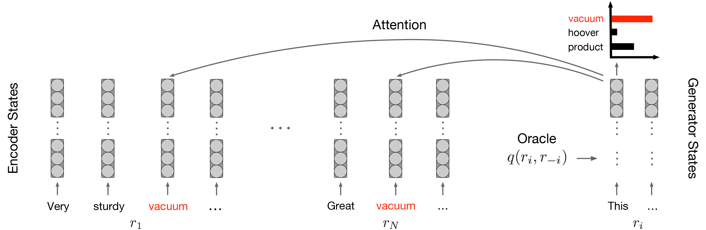

# Few-Shot Learning for Opinion Summarization

This repository contains the codebase along with accompanying artifacts of the [corresponding work](https://arxiv.org/pdf/2004.14884.pdf) published at EMNLP 2020, Dominican Republic.

<p align="center">

</p>
 
## Installation

The easiest way to proceed is to create a separate [conda environment](https://docs.conda.io/en/latest/).

```
conda create -n fewsum python=3.7.5
```

```
conda activate fewsum
```

Install required modules.

```
pip install -r requirements.txt
```

Add the root directory to the path if you want to execute scripts from the command line.

```
export PYTHONPATH=root_path:$PYTHONPATH
```

## Data


### Training data

Data pre-processing pipeline along with instructions is available from the [previous project](https://github.com/abrazinskas/Copycat-abstractive-opinion-summarizer/tree/master/preprocessing). 
Further, reviews needs to be enriched with ROUGE scores (coverage property) in the leave-one-out fashion using `fewsum/scripts/postprocess_data.py`. 
This is done to avoid online ROUGE computations that are time consuming.

We also provide the final pre-processed dataset versions, both for [Amazon](https://abrazinskas.s3-eu-west-1.amazonaws.com/downloads/projects/fewsum/artifacts/amazon/reviews.zip) and [Yelp](https://abrazinskas.s3-eu-west-1.amazonaws.com/downloads/projects/fewsum/artifacts/yelp/reviews.zip).
Unzip them to `artifacts/[yelp or amazon]/`. These datasets can be directly used to train the model.  


### Annotated summaries

For the purpose of fine-tuning and evaluation, we produced [Yelp](artifacts/yelp/gold_summs) and [Amazon](artifacts/amazon/gold_summs) annotated datasets.
More information found in the [corresponding readme file](artifacts/gold_summs.md).

## Running the model

In order to arrive to the final model, a number of steps need to be executed as described below. For each step, we provided checkpoints that can be used to generate
summaries and also used as starting points for downstream steps. 

In general, model hyper-parameters can modified by altering corresponding classes in `fewsum/config/model_hp`. 
In the same vein, one can modify the run configuration of each model in `fewsum/config/run/` classes.

The `fewsum/workflow.py` is the main file for training and inference that has logic for assembling data pipelines, tokenizers, and other relevant
components. Unless a custom setup is required, no modifications of this file is needed. 

## Preparation

We provide checkpoints for each step for Amazon, which can be downloaded by following links in each section below. 
Checkpoints need to be placed to `artifacts/amazon/checkpoints/`. 
If you use a different path, specify it in a run configuration file, e.g., `fewsum/config/model_hp/unsup_run.py`.

We also provide the word vocabulary, BPE vocabularies, and a true caser in `artifacts/amazon/misc`. These can be produced for custom datasets using scripts available in `fewsum/scripts`.

### Unsupervised pre-training

Here, we use the leave-one-out objective in order to pre-train the model on unannotated reviews using the command below; [checkpoint](https://abrazinskas.s3-eu-west-1.amazonaws.com/downloads/projects/fewsum/artifacts/amazon/checkpoints/unsupervised.tar).

```
python fewsum/workflow.py --regime=unsupervised
```

### Novelty reduction

At this stage, we reduce the novelty by penalizing output probability assignments to words that do not appear in the input reviews; [checkpoint](https://abrazinskas.s3-eu-west-1.amazonaws.com/downloads/projects/fewsum/artifacts/amazon/checkpoints/novelty_reduction.tar). 

```
python fewsum/workflow.py --regime=novelty_reduction
```

### Plug-in network initialization

Here, the plug-in network is added that is trained to predict property values for reviews (derived by the oracle) based on the leave-one-out setting; [checkpoint](https://abrazinskas.s3-eu-west-1.amazonaws.com/downloads/projects/fewsum/artifacts/amazon/checkpoints/plugin_init.tar).

```
python fewsum/workflow.py --regime=plugin_init
```

### Plug-in network tuning

In this phase, we utilize human-written abstractive summaries and tune the plug-in network to predict their property values that are derived by the oracle; [checkpoint](https://abrazinskas.s3-eu-west-1.amazonaws.com/downloads/projects/fewsum/artifacts/amazon/checkpoints/plugin_tuning.tar).

```
python fewsum/workflow.py --regime=plugin_tuning
``` 

### Joint-tuning 
This is the final phase, where we fine-tune both the plug-in network and the attention mechanism over the encoder states; [checkpoint](https://abrazinskas.s3-eu-west-1.amazonaws.com/downloads/projects/fewsum/artifacts/amazon/checkpoints/joint_tuning.tar).

```
python fewsum/workflow.py --regime=joint_tuning
```


### Summary generation
In order to generate summaries at any stage, please replace the `REGIME` token in the command below.

```
python fewsum/workflow.py --regime=REGIME --inference
```

Already generated summaries by the final model are also [available](/artifacts/amazon/gen_summs/).

## Citation
```
@inproceedings{brazinskas2020few,
  title={Few-Shot Learning for Opinion Summarization},
  author={Bra{\v{z}}inskas, Arthur and Lapata, Mirella and Titov, Ivan},
 booktitle={Proceedings of the conference on empirical methods in natural language processing (EMNLP)},
  year={2020}
}
```

## License

MIT
